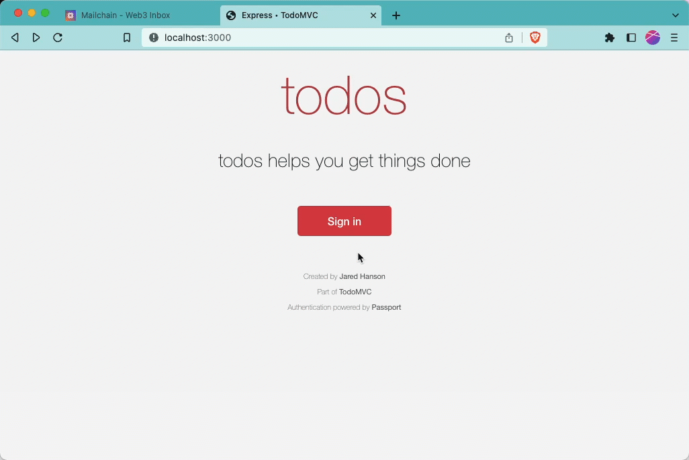

# todos-express-starter-mailchain

This is the end result of the
[Passport Magic Links with Mailchain tutorial](https://docs.mailchain.com/developer/tutorials/integrations/passport-magic-link-tutorial/).

The app a starter kit for building a todo app with sign in with Mailchain
functionality using [Express](https://expressjs.com/),
[Passport](https://www.passportjs.org/),
[Mailchain SDK](https://www.npmjs.com/package/@mailchain/sdk) and
[SQLite](https://www.sqlite.org/).



Sign-in with Mailchain features support:

- Sign in with a Mailchain address
- Sign in with Ethereum (without requiring a signature)
- Sign in with ENS (without requiring a signature)

Check out the tutorial
https://docs.mailchain.com/developer/tutorials/integrations/passport-magic-link-tutorial/.

## Getting started

Run the following to install the required dependencies:

```bash
npm install
```

To start the local development environment, run:

```bash
npm start
```

## License

[The Unlicense](https://opensource.org/licenses/unlicense)

## Credit

Created by [Jared Hanson](https://www.jaredhanson.me/)

Adapted by [Mailchain](https://mailchain.com)
